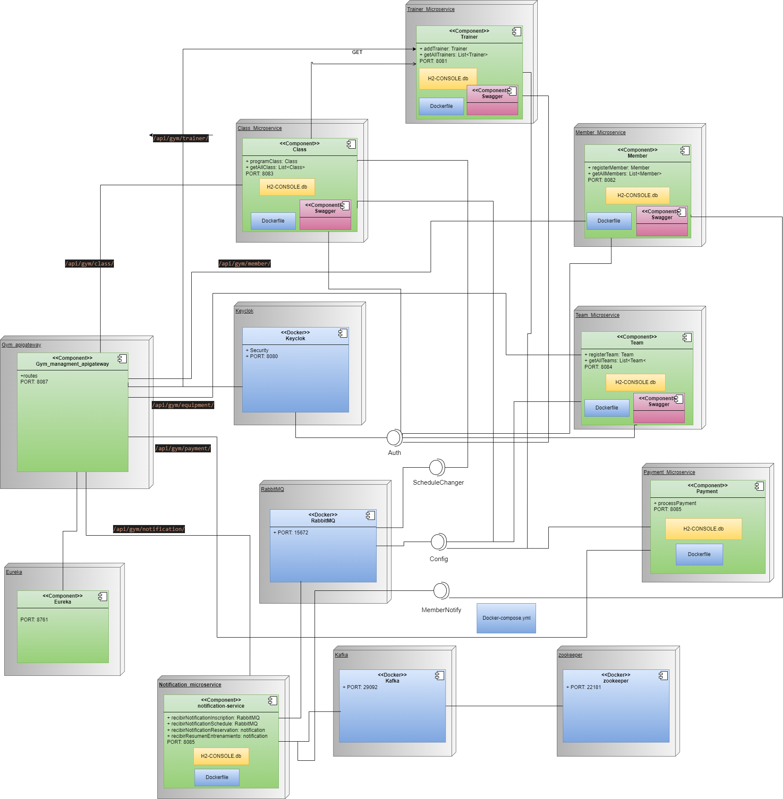

# Gym_manager_microservices

Este proyecto es un sistema de gestión de gimnasios diseñado utilizando una arquitectura de microservicios. Cada microservicio es responsable de una parte específica de la funcionalidad del gimnasio, permitiendo una alta escalabilidad y mantenibilidad del sistema.

## Especificaciones del proyecto

### Microservicios

1. **Microservicio de socios**
   - **Responsabilidad**: Gestión de los miembros del gimnasio.
   - **Base de datos**: Base de datos de socios.
   - **Endpoints**:
     - `POST /miembros`: Crear un nuevo miembro.
     - `GET /miembros`: Recupera todos los miembros.

2. **Clase Microservicio**
   - **Responsabilidad**: Gestión de las clases programadas del gimnasio.
   - **Base de datos**: Base de datos de clases.
   - **Endpoints**:
     - `POST /clase`: Programar una nueva clase.
     - `GET /class`: Recupera todas las clases.

3. **Microservicio de formación**
   - **Responsabilidad**: Gestión de formadores.
   - **Base de datos**: Base de datos de formadores.
   - **Endpoints**:
     - `POST /entrenador`: Crear un nuevo entrenador.
     - `GET /entrenador`: Recupera todos los entrenadores.

4. **Microservicio de equipo**
   - **Responsabilidad**: Gestión de los equipos del gimnasio.
   - **Base de datos**: Base de datos de equipos.
   - **Endpoints**:
     - `POST /equipo`: Crear un nuevo equipo.
     - `GET /equipo`: Recuperar todos los equipos.

Diseño de la arquitectura



## Configuración de Keycloak

1. **Crear un Dominio:** Configure un nuevo Dominio en Keycloak para su aplicación.
2. **Crear Clientes:**
    - Vaya a la sección «Clients» y cree un nuevo cliente llamado `Team-services`.
    - Configure los siguientes parámetros:
      - `Client ID`: `Team-services`
      - Protocolo del cliente: Openid-Connect
      - Tipo de acceso: confidencial
    - Asegúrese de que los siguientes flujos de autenticación están habilitados:
      - Flujo estándar habilitado: `true`.
      - Concesiones de acceso directo habilitadas: `true`.
    - Añada los `Redirect URIs`:
      - http://localhost:8080/
      - http://localhost:8084/
3. **Crear roles:**
    - Cree roles para su aplicación: `ROLE_MEMBER`, `ROLE_TRAINER`, `ROLE_ADMIN`.
4. **Crear Usuarios:**
    - Cree usuarios en Keycloak y asígneles los roles correspondientes.

## Documentación de la API con Swagger

Swagger está integrado para proporcionar una interfaz de usuario interactiva para la documentación de la API. Para acceder a la documentación Swagger:

- Asegúrese de que la aplicación se está ejecutando.
- Navegue a: `http://localhost:8082/swagger-ui.html

🐇 Implementación de RabbitMQ
--------------------------

En este proyecto, hemos implementado RabbitMQ como middleware de mensajería para manejar diferentes patrones de comunicación entre microservicios. A continuación se describe cómo se han implementado las principales funcionalidades de RabbitMQ, incluyendo el sistema de notificaciones para nuevas inscripciones, el patrón publish/subscribe para cambios en los horarios de clase, y el manejo de la Cola de Letras Muertas (DLQ) para pagos fallidos.

### Instalación de RabbitMQ

Para empezar, asegúrese de que RabbitMQ está instalado y funcionando localmente o en un servidor. Si aún no lo tiene instalado, puede hacerlo ejecutando el siguiente comando:

```bash
docker run -d --name rabbitmq -p 5672:5672 -p 15672:15672 rabbitmq:3-management
```

Una vez iniciado el contenedor, puede acceder al panel de administración de RabbitMQ en `http://localhost:15672` con las credenciales por defecto:

* Usuario: `guest`
* Contraseña: `guest`

* * *

### Configuración de RabbitMQ en código
En cada microservicio hemos creado una clase de configuración [RabbitMQConfig.java](/Class_Microservice/src/main/java/com/icesi/edu/co/config/ClassRabbitConfig.java) para definir los intercambios, colas y bindings.

### Sistema de notificación de nuevas inscripciones
El sistema de notificación para nuevas inscripciones se implementa utilizando un patrón de cola simple en el microservicio Members. Cada vez que un nuevo miembro se registra, se envía un mensaje a una cola RabbitMQ, que posteriormente es consumida por un servicio que envía una notificación.

### Recuperación y Procesamiento de Mensajes con Kafka

Recuperación de Mensajes con `RecuperacionService`

La clase `RecuperacionService` se encarga de procesar mensajes desde el tópico de Kafka `class-reservation`. Implementa un mecanismo de manejo de **offsets** para asegurar que cada mensaje sea procesado correctamente y evitar la pérdida o duplicación de datos.

### Características Principales
1. **Suscripción a Kafka**: El consumidor de Kafka se suscribe al tópico `class-reservation` para recibir mensajes de tipo `ReservationDTO`.
2. **Recuperación de Offsets**: Utiliza un repositorio (`OffsetRepository`) para cargar el último offset procesado y continuar el procesamiento desde ese punto.
3. **Procesamiento de Mensajes**: Cada mensaje recibido es procesado a través del método `procesarRecord()`, y posteriormente se guarda el offset procesado.
4. **Almacenamiento de Offsets**: Los offsets procesados se guardan en un repositorio externo, permitiendo la continuidad del procesamiento en caso de fallos.

### Flujo de Trabajo
1. **Inicialización**:
   - El método `iniciarProcesamiento()` suscribe el consumidor al tópico `class-reservation`.
   - Recupera el último offset procesado para cada partición del tópico mediante el método `cargarUltimoOffset()`.
2. **Procesamiento de Mensajes**:
   - Se reciben mensajes de Kafka y se procesan a través del método `procesarRecord()`.
   - Tras procesar cada mensaje, el offset correspondiente es guardado en `OffsetRepository` mediante `guardarOffset()`.
3. **Recuperación de Estado**:
   - Si la aplicación se detiene o falla, en el próximo inicio se recuperan los offsets almacenados, asegurando que los mensajes no procesados sean manejados correctamente.

---

## Componentes del Sistema

### Clase `RecuperacionService`
Es la clase principal responsable del procesamiento de los mensajes. Utiliza un consumidor de Kafka para recibir mensajes del tópico `class-reservation`.

- **`KafkaConsumer<String, ReservationDTO> consumer`**: El consumidor que se suscribe a Kafka y maneja los mensajes recibidos.
- **`OffsetRepository offsetRepository`**: Repositorio para almacenar y recuperar los offsets procesados.

#### Métodos
- **`iniciarProcesamiento()`**: Inicia la suscripción al tópico de Kafka y gestiona el procesamiento de los mensajes. También recupera el último offset procesado.
- **`cargarUltimoOffset()`**: Recupera los offsets más recientes desde el repositorio.
- **`procesarRecord(ConsumerRecord<String, ReservationDTO> record)`**: Procesa cada mensaje recibido.
- **`guardarOffset(String topic, int partition, long offset)`**: Guarda el offset procesado en el repositorio.

### Interfaz `OffsetRepository`
Este componente gestiona el almacenamiento y la recuperación de los offsets de Kafka en un repositorio persistente.

#### Métodos esperados
- **`getLastOffsets()`**: Recupera los últimos offsets procesados para cada partición del tópico.
- **`saveOffset(String topic, int partition, long offset)`**: Guarda el offset procesado después de cada mensaje.

---

## Api gateway

Configuracion de rutas
```
spring.cloud.gateway.routes[0].predicates[0]=Path=/api/gym/trainer/**
spring.cloud.gateway.routes[1].predicates[0]=Path=/api/gym/member/**
spring.cloud.gateway.routes[2].predicates[0]=Path=/api/gym/class/**
spring.cloud.gateway.routes[3].predicates[0]=Path=/api/gym/equipment/**
spring.cloud.gateway.routes[4].predicates[0]=Path=/api/gym/notification/**
spring.cloud.gateway.routes[5].predicates[0]=Path=/api/gym/payment/**
```

## Authors

- Jesus Garces
- Juan Pablo Acevedo
- Juan Sebastian Diaz

